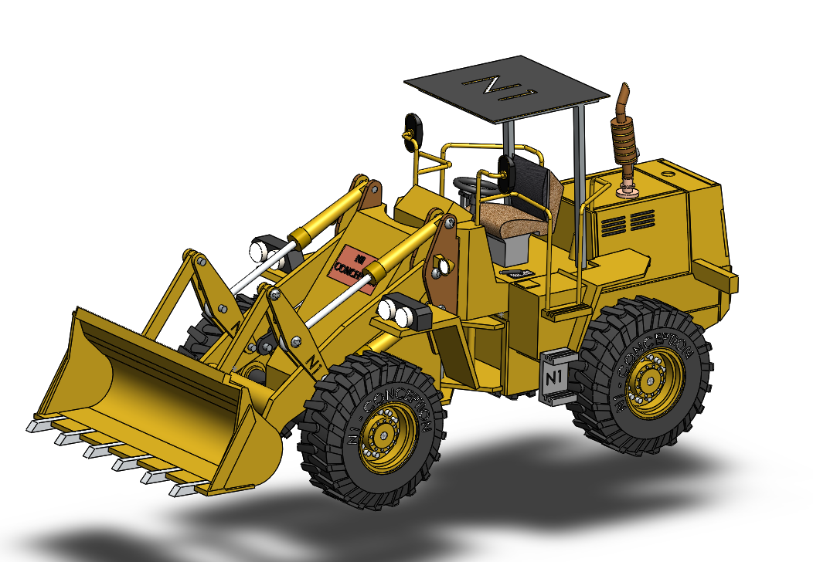
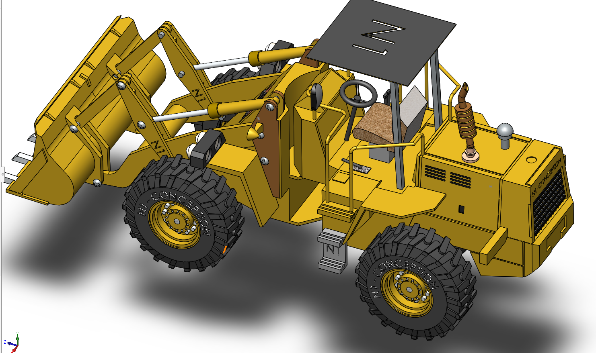
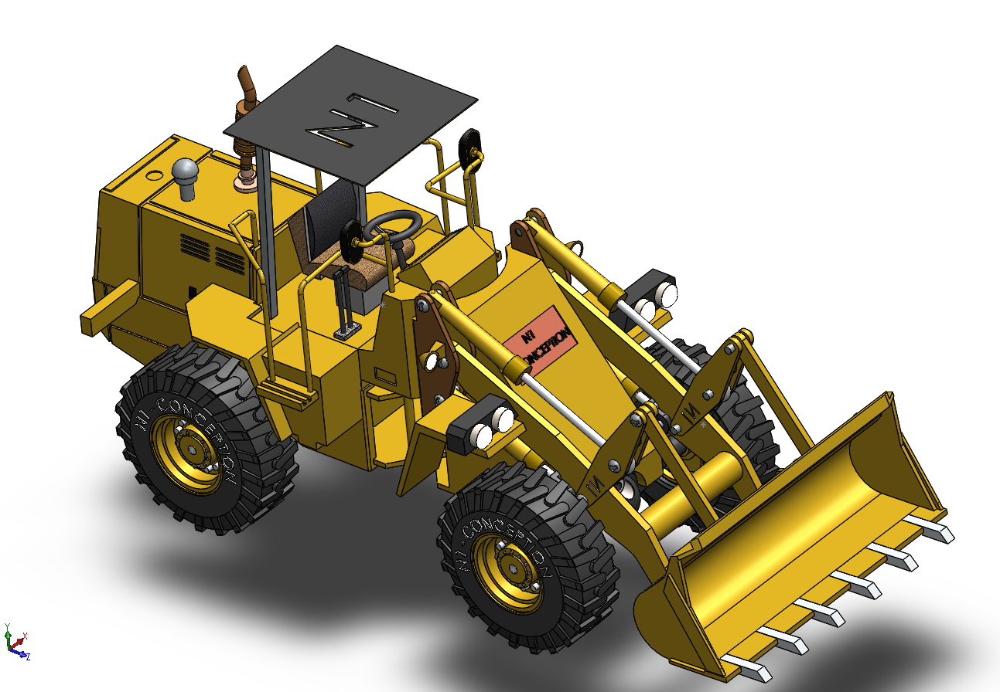
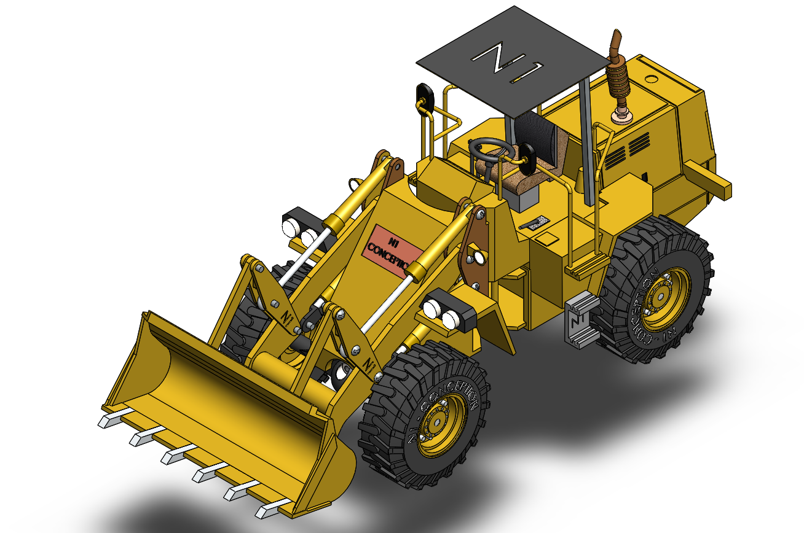
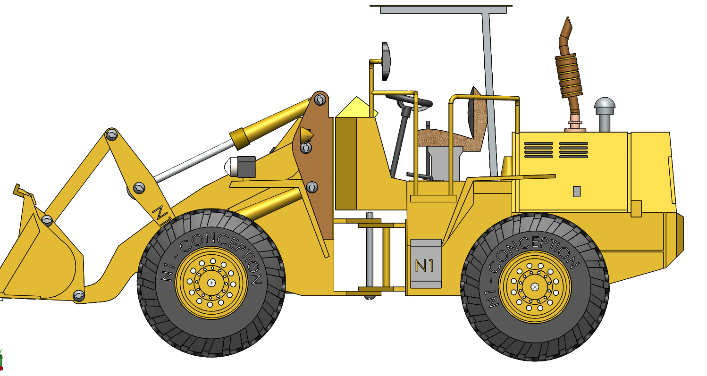

# Part-drawing-1-SW

# 🚜 Wheel Loader Motion | SolidWorks Project

Welcome to the *Wheel Loader Motion* project  — a high-detail 3D model brought to life through motion animation in *SolidWorks*.

## 📌 About the Project

This project is a continuation of my previous static SolidWorks model of a *realistic wheel loader*, now enhanced with basic motion elements including:

- ✅ *Bucket Lift & Tilt Animation*

- ✅ *Tyre Rotation*

- 🛠 Built using *mates* and *motion constraints* to replicate real-world mechanical movement

> ⚙ This is part of a mechanical design series focused on modeling and animating construction machines using CAD.

## 🎥 Preview Video

> 📽 Watch the full Shorts demo showcasing the loader in motion!

## 🧰 Tools & Software

- SolidWorks (Modeling + Motion Study)

- YouTube (For showcase)

- GitHub (For sharing files & documentation)

## Author-

Nishchay Sharma

>B.Tech Mechanical Engineering

>Gold Medalist | Design Engineer

*Built with precision. Powered by design.*  
N1 Conception | 2025
  

## File Include
- 'project01_nishchay.  SLDASM' -
solidworks Assembly file

## License
this project is licensed under the MIT license.

### Isometric View 1

### Isometric View 2

### Isometric View 3

### Isometric View 4

### Side View

Thanks for viewing!

