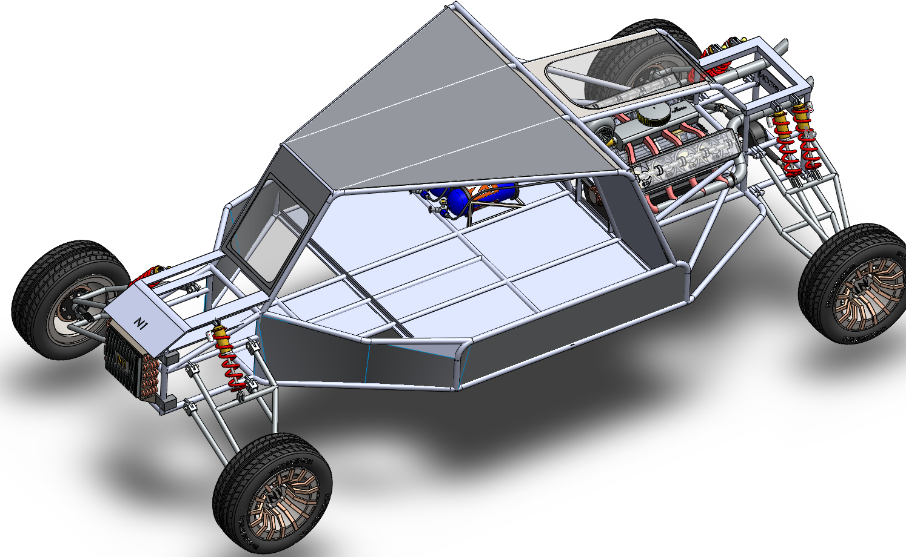
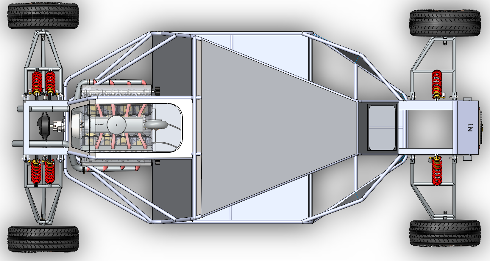
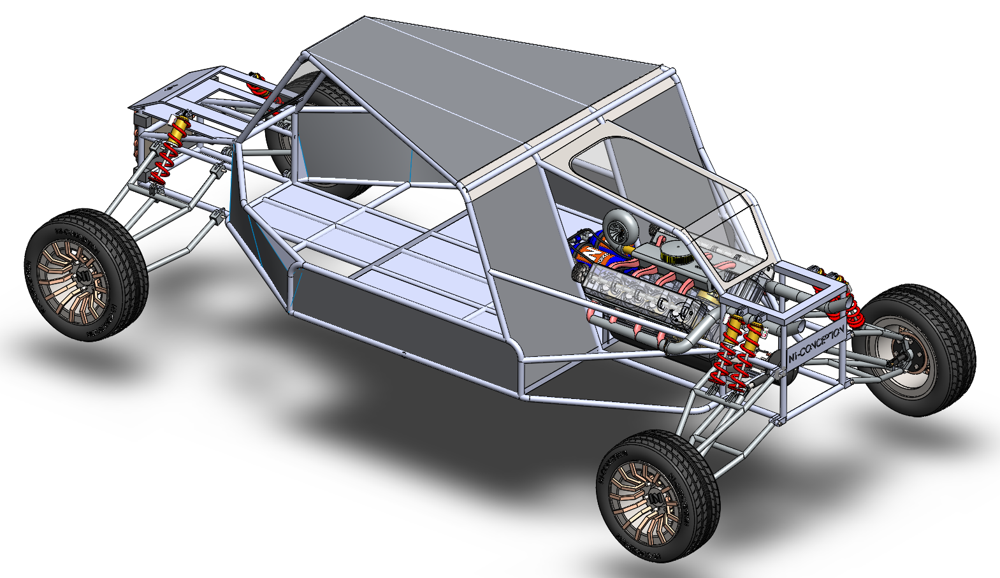

# Part-drawing-1-SW

# 🏎️ Off-Road Buggy Design (SolidWorks)

## 📌 Overview

This repository contains the **design and development of an off-road buggy** created in **SolidWorks**. The project focuses on a practical, manufacturable structure while maintaining a rugged and performance-oriented design approach suitable for rough terrain applications.

The model reflects real-world design intent, emphasizing **structural integrity, functionality, and clean assembly logic** rather than just visual appeal.

---

## 🎯 Objectives of the Design

* Develop a robust off-road buggy structure.

* Apply mechanical design fundamentals in a real application.

* Practice part modeling, assembly constraints, and design intent.

* Ensure feasibility from a manufacturing perspective

---

## 🛠️ Tools & Software Used

* **SolidWorks** (Part Modeling & Assembly)

* Basic mechanical design principles

* Parametric and constraint-based modeling

---

## 📂 Project Contents

* Individual **buggy components** modeled as separate parts

* **Assembly file** showcasing the complete buggy structure

* Organized feature tree with clear naming conventions

* Design created keeping alignment, symmetry, and structural balance in mind

---

## 🔩 Key Design Highlights

* Tubular-style frame concept inspired by off-road vehicles

* Proper mating and alignment of major components

* Balanced proportions for stability and visual realism

* Designed with scope for future upgrades (suspension, drivetrain, steering, etc.)

---

## ⚙️ Current Status

🚧 **Work in Progress**

* Core structure completed

* Some components are still under refinement

* Functional systems (suspension, steering, powertrain) may be added or improved in future iterations

---

## 🚀 Future Improvements

* Addition of suspension system
* Steering and wheel assembly
* Powertrain layout
* Motion study and basic simulation
* Design optimization for weight reduction

---

## 📸 Preview

> Add rendered images or screenshots of the buggy here for better visualization.

---

## 👤 Author

**Nishchay Sharma**

Mechanical Engineer | Specializing in Design Engineering

---

## 📄 License

This project is licensed under the **MIT License** — feel free to use, modify, and learn from it.

---

⭐ If you like this project or find it useful, consider giving the repository a star!

## License
this project is licensed under the MIT license.

### Isometric View 

### Top View 

### Isometric View 2

**Designed by N1 Conception** 

Thanks for viewing!

